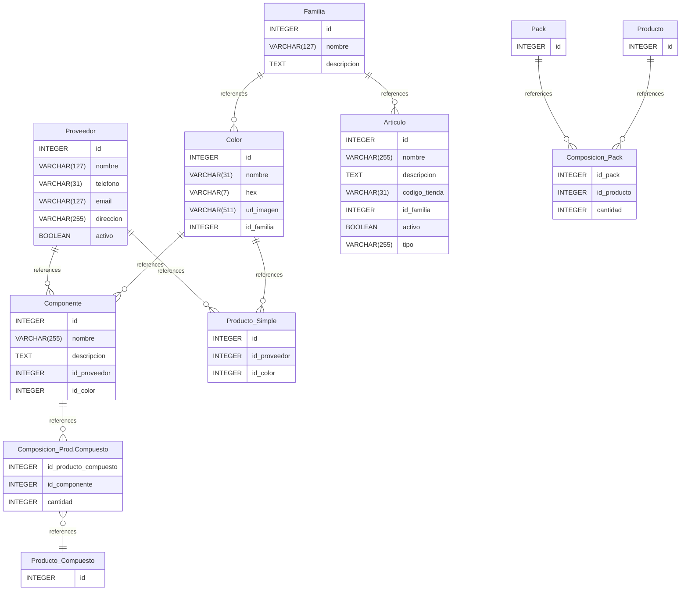

# oficit-stock documentation
## Summary

- [Introduction](#introduction)
- [Database Type](#database-type)
- [Table Structure](#table-structure)
	- [Componente](#componente)
	- [Proveedor](#proveedor)
	- [Color](#color)
	- [Familia](#familia)
	- [Articulo](#articulo)
	- [Producto_Simple](#producto_simple)
	- [Producto_Compuesto](#producto_compuesto)
	- [Composicion_Prod.Compuesto](#composicion_prod.compuesto)
	- [Pack](#pack)
	- [Composicion_Pack](#composicion_pack)
	- [Producto](#producto)
- [Relationships](#relationships)
- [Database Diagram](#database-diagram)

## Introduction

## Database type

- **Database system:** PostgreSQL
## Table structure

### Componente

| Name        | Type          | Settings                      | References                    | Note                           |
|-------------|---------------|-------------------------------|-------------------------------|--------------------------------|
| **id** | INTEGER | 🔑 PK, not null, unique, autoincrement | Componente(1)-Composiciones(n) | |
| **nombre** | VARCHAR(255) | not null, unique |  | |
| **descripcion** | TEXT | null |  | |
| **id_proveedor** | INTEGER | null |  | |
| **id_color** | INTEGER | null |  | | 

### Proveedor

| Name        | Type          | Settings                      | References                    | Note                           |
|-------------|---------------|-------------------------------|-------------------------------|--------------------------------|
| **id** | INTEGER | 🔑 PK, not null, unique, autoincrement | Proveedor(1)-Componentes(n),Proveedor(1)-ProductosSimples(n) | |
| **nombre** | VARCHAR(127) | not null, unique |  | |
| **telefono** | VARCHAR(31) | null |  | |
| **email** | VARCHAR(127) | null |  | |
| **direccion** | VARCHAR(255) | null |  | |
| **activo** | BOOLEAN | null, default: False |  | | 

### Color

| Name        | Type          | Settings                      | References                    | Note                           |
|-------------|---------------|-------------------------------|-------------------------------|--------------------------------|
| **id** | INTEGER | 🔑 PK, not null, unique, autoincrement | Color(1)-Componentes(n),Color(1)-Prod.Simples(n) | |
| **nombre** | VARCHAR(31) | not null, unique |  | |
| **hex** | VARCHAR(7) | null |  | |
| **url_imagen** | VARCHAR(511) | null |  | |
| **id_familia** | INTEGER | null |  | | 

### Familia

| Name        | Type          | Settings                      | References                    | Note                           |
|-------------|---------------|-------------------------------|-------------------------------|--------------------------------|
| **id** | INTEGER | 🔑 PK, not null, unique, autoincrement | Familia(1)-Colores(n),Familia(1)-Articulos(n) | |
| **nombre** | VARCHAR(127) | not null, unique |  | |
| **descripcion** | TEXT | null |  | | 

### Articulo

| Name        | Type          | Settings                      | References                    | Note                           |
|-------------|---------------|-------------------------------|-------------------------------|--------------------------------|
| **id** | INTEGER | 🔑 PK, not null, unique, autoincrement |  | |
| **nombre** | VARCHAR(255) | null |  | |
| **descripcion** | TEXT | null |  | |
| **codigo_tienda** | VARCHAR(31) | null, unique |  | |
| **id_familia** | INTEGER | null |  | |
| **activo** | BOOLEAN | null, default: False |  | |
| **tipo** | VARCHAR(255) | not null |  | | 

### Producto_Simple

| Name        | Type          | Settings                      | References                    | Note                           |
|-------------|---------------|-------------------------------|-------------------------------|--------------------------------|
| **id** | INTEGER | 🔑 PK, not null, unique, autoincrement |  | |
| **id_proveedor** | INTEGER | null |  | |
| **id_color** | INTEGER | null |  | | 

### Producto_Compuesto

| Name        | Type          | Settings                      | References                    | Note                           |
|-------------|---------------|-------------------------------|-------------------------------|--------------------------------|
| **id** | INTEGER | 🔑 PK, not null, unique, autoincrement |  | | 

### Composicion_Prod.Compuesto

| Name        | Type          | Settings                      | References                    | Note                           |
|-------------|---------------|-------------------------------|-------------------------------|--------------------------------|
| **id_producto_compuesto** | INTEGER | 🔑 PK, null | ProductoCompuesto(1)-Composiciones(n) | |
| **id_componente** | INTEGER | 🔑 PK, null |  | |
| **cantidad** | INTEGER | null |  | | 

### Pack

| Name        | Type          | Settings                      | References                    | Note                           |
|-------------|---------------|-------------------------------|-------------------------------|--------------------------------|
| **id** | INTEGER | 🔑 PK, not null, unique, autoincrement | Pack(1)-Composiciones(n) | | 

### Composicion_Pack

| Name        | Type          | Settings                      | References                    | Note                           |
|-------------|---------------|-------------------------------|-------------------------------|--------------------------------|
| **id_pack** | INTEGER | 🔑 PK, not null, unique, autoincrement |  | |
| **id_producto** | INTEGER | 🔑 PK, not null |  | |
| **cantidad** | INTEGER | not null, default: 0 |  | | 

### Producto

| Name        | Type          | Settings                      | References                    | Note                           |
|-------------|---------------|-------------------------------|-------------------------------|--------------------------------|
| **id** | INTEGER | 🔑 PK, not null, unique, autoincrement | Producto(1)-Composiciones(n) | | 

## Relationships

- **Familia to Color**: one_to_many
- **Proveedor to Componente**: one_to_many
- **Familia to Articulo**: one_to_many
- **Proveedor to Producto_Simple**: one_to_many
- **Composicion_Prod.Compuesto to Producto_Compuesto**: many_to_one
- **Componente to Composicion_Prod.Compuesto**: one_to_many
- **Pack to Composicion_Pack**: one_to_many
- **Producto to Composicion_Pack**: one_to_many
- **Color to Componente**: one_to_many
- **Color to Producto_Simple**: one_to_many

## Database Diagram

